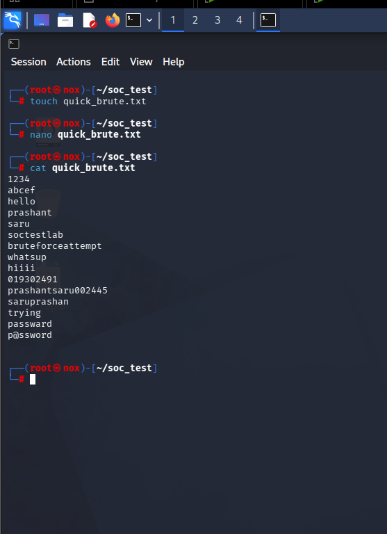
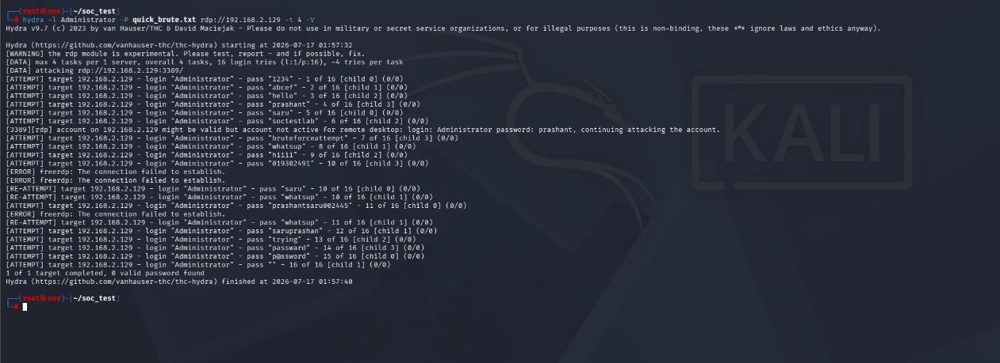
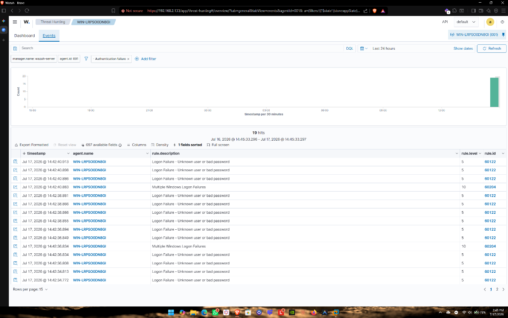
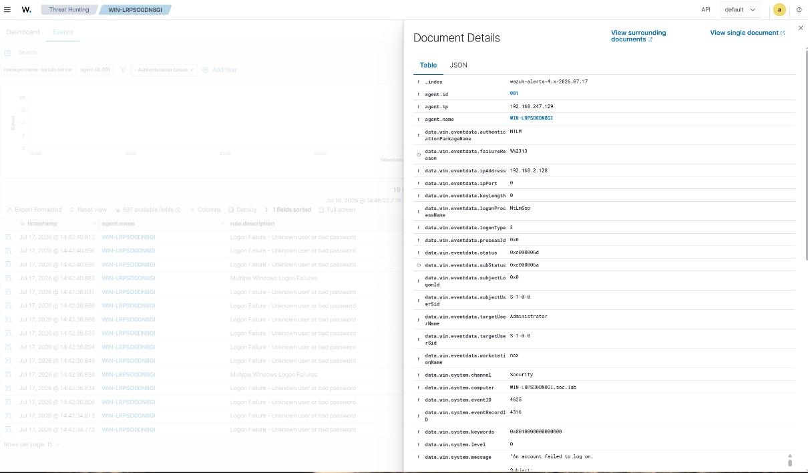

# Wazuh: Brute Force Detection

**Goal:** simulate a dictionary-based RDP brute-force attack and confirm the Wazuh SIEM detects, correlates, and escalates it correctly.

**ATT&CK mapping:** T1110 – Brute Force

## Setup

- Attacker: Kali Linux (`192.168.2.128`)
- Target: Windows Server 2019, `WIN-LRPS0ODN8GI` (`192.168.2.129`), RDP exposed on port 3389
- SIEM: Wazuh Manager (`192.168.2.133`), Windows agent already enrolled

## Steps

1. Built a custom wordlist (`quick_brute.txt`) containing a mix of common and personalized password guesses.

   

2. Ran a THC-Hydra dictionary attack against the built-in Administrator account over RDP:

   ```bash
   hydra -l Administrator -P quick_brute.txt rdp://192.168.2.129 -t 4 -V
   ```

   

   Hydra's verbose output flagged one password as recognized by the system but blocked by policy (`account may be valid but not active for remote desktop`), and then hit the target's rate-limiting — visible as a run of `freerdp: connection failed to establish` errors once the attack volume increased.

## Detection results

Wazuh parsed the forwarded Windows Security events and fired two distinct rules:

| Rule ID | Level | Description |
|---|---|---|
| 60122 | 5 | Windows: logon failure — unknown user or bad password (fires per failed attempt) |
| 60204 | 10 | Multiple Windows logon failures — correlated escalation once failures cluster in a short window |

The dashboard recorded **19 aggregated authentication failures** during the attack window.



Drilling into a single event confirms the attacking source, target account, and hostname:



## Forensic summary

| Field | Value | Why it matters |
|---|---|---|
| Target hostname | `WIN-LRPS0ODN8GI` | Confirms which endpoint was under attack |
| Triggered rules | 60122, 60204 | Shows the escalation path from single failure to correlated brute-force alert |
| Severity | Level 10 | Crosses the threshold for analyst notification |

## Conclusion & recommendation

A single low-severity rule (60122) firing repeatedly in a short window is the classic brute-force signature; Wazuh's correlation rule (60204) is what turns noise into an actionable alert. In production, this should also trigger an **active response** (temporary account lockout or source-IP block) rather than just a dashboard alert — detection without automated containment still leaves a window for the attacker to eventually succeed.
