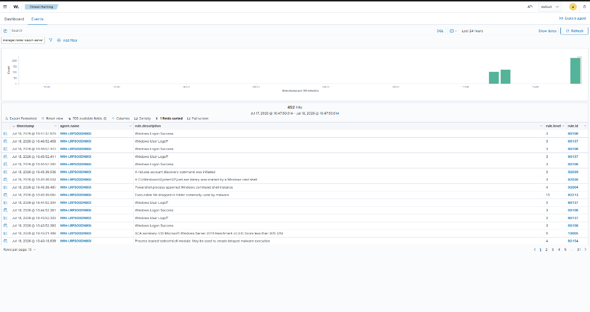
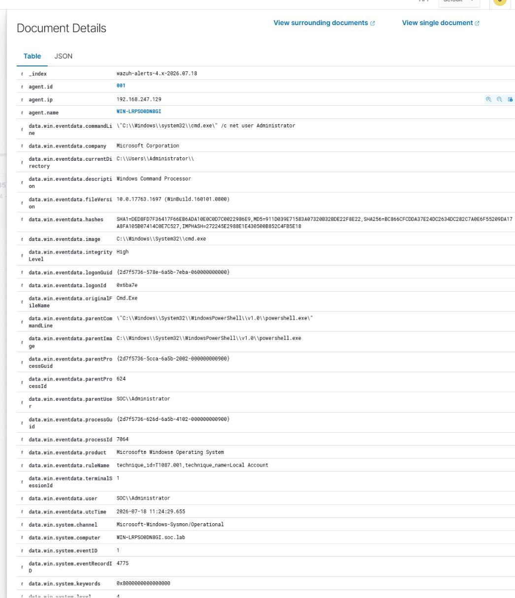

# Windows + Sysmon: Process Analysis

**Goal:** simulate a suspicious process execution and use Sysmon telemetry to trace process lineage and command-line arguments.

**ATT&CK mapping:** T1087.001 – Account Discovery: Local Account

## Setup

- Target: Windows Server 2019, `WIN-LRPS0ODN8GI`, with Sysmon deployed using a standard baseline config, forwarding to Wazuh.

## Simulated activity

Ran a PowerShell command that spawns a non-interactive `cmd.exe` to enumerate the local Administrator account — a common reconnaissance pattern:

```powershell
Start-Process cmd.exe -ArgumentList '/c net user Administrator'
```

## Sysmon Event ID 1 (Process Create) findings

| Field | Value | Significance |
|---|---|---|
| Event ID | 1 | Process creation |
| Child process | `C:\Windows\System32\cmd.exe` (PID 7064) | Binary that actually executed |
| Command line | `"C:\Windows\system32\cmd.exe" /c net user Administrator` | Full command-line visibility |
| Parent process | `powershell.exe` (PID 624) | Confirms PowerShell spawned the child shell |
| User context | `SOC\Administrator` | Privilege level of execution |





## Suspicious vs. normal — how I made the call

- **Process lineage:** an admin-context PowerShell session spawning a short-lived, non-interactive `cmd.exe` to run a single utility is unusual for normal user workflow — most legitimate admin tasks stay inside PowerShell rather than shelling out to `cmd.exe` for a single command.
- **Command-line content:** the literal string `net user Administrator` is a direct account-enumeration command, mapping cleanly to **T1087.001**.
- **Both binaries are legitimate, signed Windows utilities** — this is a textbook Living-off-the-Land (LOLBin) pattern, which is exactly why command-line visibility (not just "what process ran") is the critical signal here.

## Conclusion & recommendation

Flag this pattern for follow-up: verify who was logged in as `SOC\Administrator` at that timestamp, check for any subsequent lateral-movement indicators, and consider a detection rule specifically for `powershell.exe` → `cmd.exe /c net user*` chains, since that combination is a much stronger signal than either event alone.
