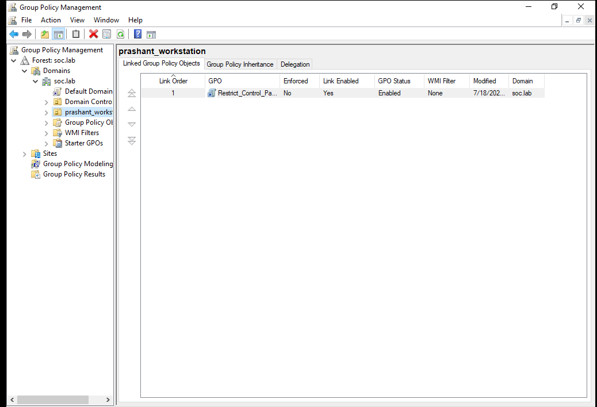
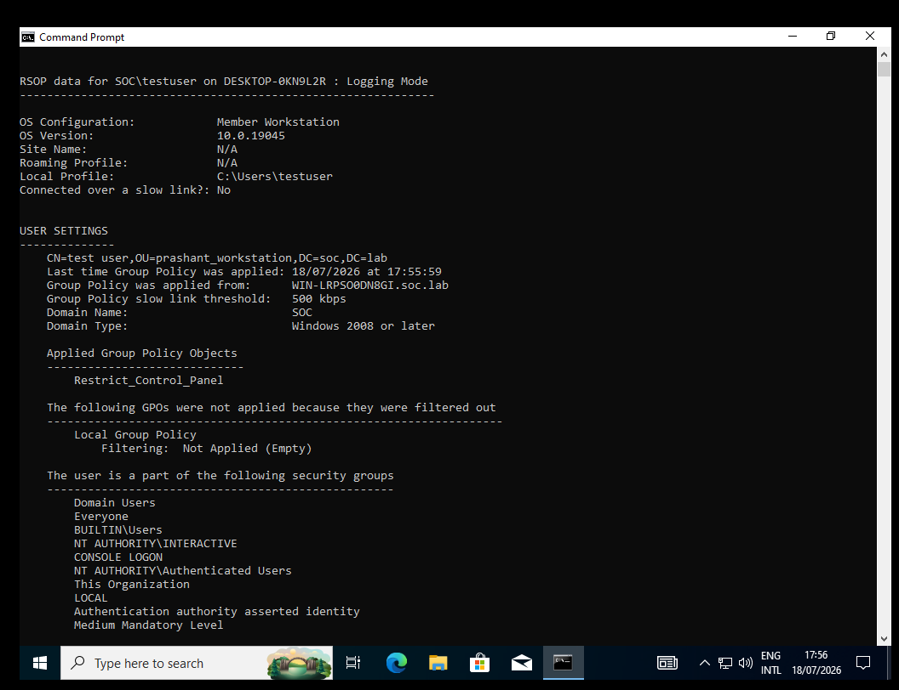
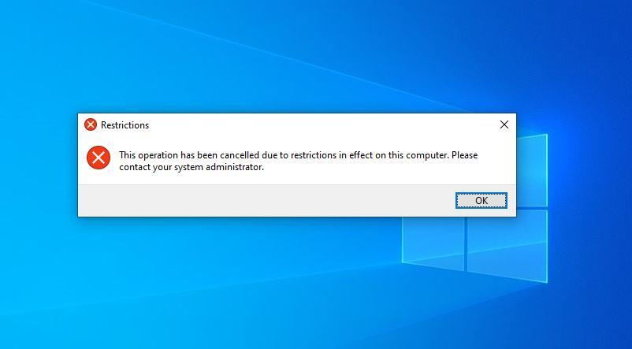

# Active Directory: GPO Deployment

**Goal:** enforce a Control Panel restriction across a scoped OU using Group Policy, and verify it actually applies on a domain-joined client.

**Type:** Defensive control (endpoint hardening)

## Steps

1. **OU provisioning** — created a dedicated Organizational Unit, `prashant_workstation`, in Active Directory Users and Computers (`dsa.msc`).
2. **Test account** — provisioned a scoped test identity, `testuser@soc.lab`, inside that OU.
3. **GPO creation & linking** — in the Group Policy Management Console (`gpmc.msc`), created and linked a new GPO named `Restrict_Control_Panel` directly to the target OU.
4. **Policy configuration** — under `User Configuration → Policies → Administrative Templates → Control Panel`, set **Prohibit access to Control Panel and PC settings** to **Enabled**.



5. **Client-side enforcement** — logged into a domain-joined Windows 10 workstation as `testuser`, forced an immediate policy refresh, and confirmed application via `gpresult`:

   ```powershell
   gpupdate /force
   gpresult /r
   ```

   

## Verification

Attempting to open Control Panel from the Start menu on the client is immediately blocked with the expected Windows restriction dialog:



## Conclusion & recommendation

The GPO applied cleanly and enforcement was confirmed both via `gpresult` (server-side view of applied policy) and an actual blocked attempt on the client (real-world verification) — checking both matters, since a GPO can show as "applied" while still failing to take effect due to WMI filtering, loopback processing, or conflicting linked policies. In a production rollout, I'd stage this to a pilot OU first, monitor for helpdesk tickets from legitimate Control Panel use cases (e.g. users who need Device Manager or network troubleshooting access), and use **Group Policy Modeling** to simulate the policy against other OUs before wider deployment.
