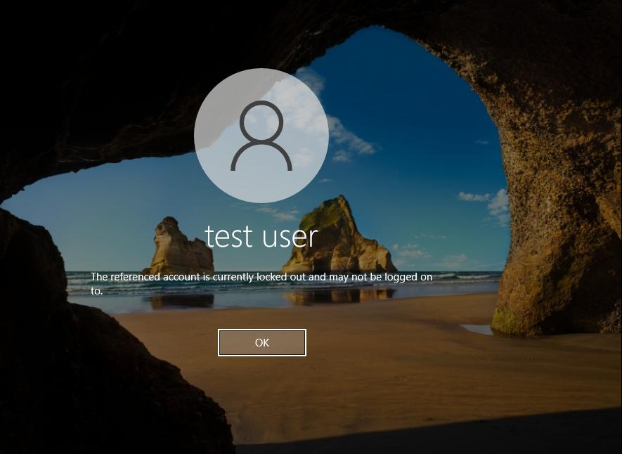
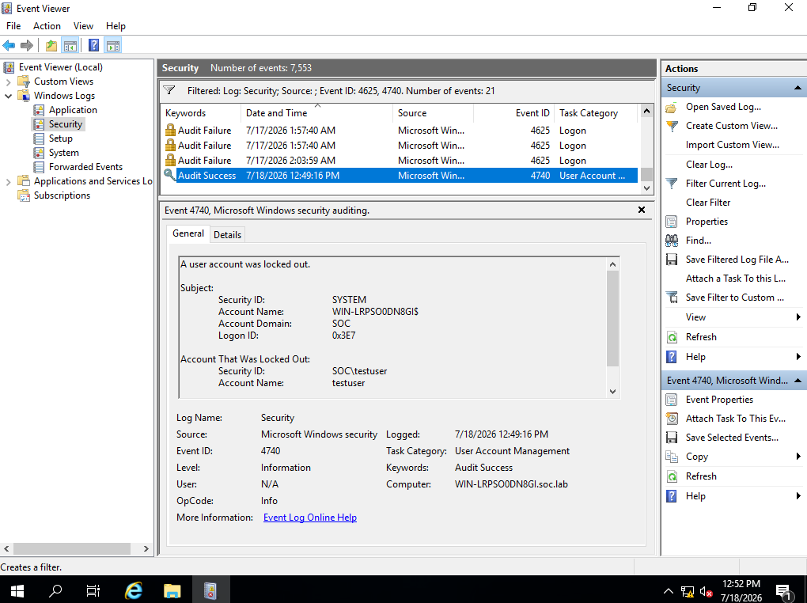

# Q4 — Active Directory: Attack Detection (Account Lockout)

**Goal:** simulate a brute-force credential attack against a domain account and trace the resulting lockout through Domain Controller security logs.

**ATT&CK mapping:** T1110 – Brute Force

## Simulated activity

Entered 5 consecutive incorrect passwords against `SOC\testuser` from a domain-joined Windows 10 client. The domain's Account Lockout Policy threshold was crossed, and the account was automatically disabled.

## Log analysis (Domain Controller Security.evtx)

| Event ID | Meaning | Observation |
|---|---|---|
| 4625 | Logon failure | A tight, rapid cluster of failures within seconds — high enough frequency to rule out normal typing errors |
| 4740 | Account lockout | Fired immediately after the 4625 cluster, naming the target account and the source workstation |

The **Caller Computer Name** field on the 4740 event captured the exact hostname of the attacking workstation — this is the key attribution point: without it, you'd know an account was locked out but not where the attempts originated.

## How I distinguished this from a legitimate mistyped password

A real user fat-fingering their password 2-3 times looks nothing like this: the 4625 events here were tightly timestamped (seconds apart, not the minute-plus gaps of a human retrying), and the volume (5 failures back-to-back) matched the domain's exact lockout threshold — consistent with an automated or intentional attempt rather than normal user error.

## Conclusion & recommendation

Event ID 4740's Caller Computer Name is the single most useful field for attribution in this scenario — it should be a mandatory field in any AD-focused SIEM correlation rule. I'd also recommend pairing lockout alerts with a check against known legitimate source hosts, since a lockout originating from a workstation the user doesn't normally use is a much stronger signal than the lockout event alone.
