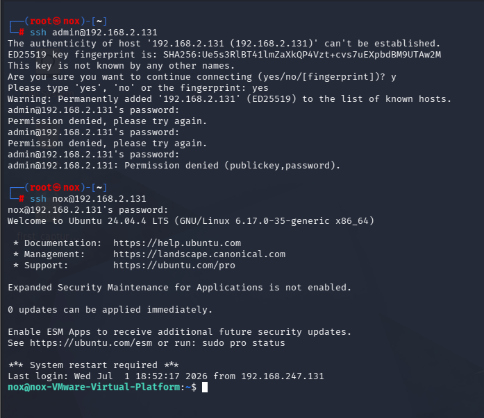
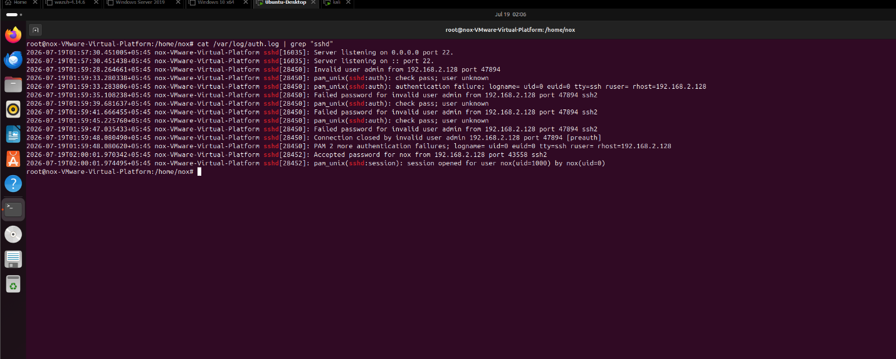

#  Linux Monitoring: Authentication Analysis

**Goal:** simulate both unauthorized and authorized SSH logins, and extract the forensic markers that separate them in `/var/log/auth.log`.

**ATT&CK mapping:** T1110 – Brute Force

## Setup

- Attacker: Kali Linux (`192.168.2.128`)
- Target: Ubuntu Desktop (`192.168.2.131`)

## Simulated activity

1. **Suspicious phase** — repeated SSH connection attempts against a non-existent `admin` account, generating a rapid burst of `Failed password` entries within a ~14-second window.
2. **Normal phase** — a single, correct-credential SSH session as the legitimate local account.

## Log extraction matrix

| Metric | Suspicious activity | Normal activity |
|---|---|---|
| Target username | `admin` (invalid) | valid local account |
| Source IP | 192.168.2.128 | 192.168.2.128 |
| Auth status | Failed password | Accepted password |
| sshd PID | 28450 | 28452 |

## How to tell suspicious from normal

- **Volume + timing:** multiple failures against a generic/non-existent username clustered within seconds points to automated scanning rather than a person mistyping a password.
- **Username validity:** targeting `admin` (a default/guessable account rather than a real one) is itself a signal — real users don't usually mistype their own username as `admin`.
- **Session outcome:** the legitimate login authenticates on the first attempt and opens a normal session (`session opened for user ...`), with no preceding failure cluster.

## Conclusion & recommendation

For Linux hosts, `/var/log/auth.log` alone gives you username, source IP, and outcome — enough to build a simple detection rule (e.g., N failed attempts against invalid usernames within a time window from one source IP). I'd forward this log to the SIEM with a correlation rule mirroring the Windows 4625/4740 pattern, and pair it with `fail2ban` or an equivalent for automated source-IP blocking on repeated failures.
