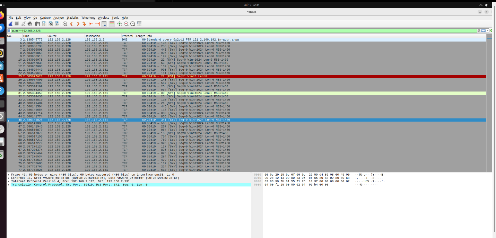

# Network Traffic Analysis: Wireshark

**Goal:** capture live traffic on a target Linux host and use Wireshark to identify the signature of an active port scan.

**ATT&CK mapping:** T1046 – Network Service Discovery

## Capture setup

- Source (attacker): `192.168.2.128`
- Destination (target): `192.168.2.131`
- Interface: `ens33`
- Display filter: `ip.src == 192.168.2.128`

## Findings

The isolated stream shows a dense, rapid-fire sequence of TCP `[SYN]` packets hitting many different destination ports (22, 80, 443, plus a scattering of legacy ports like 109, 135, 256) within milliseconds of each other — with **no completed three-way handshakes**. Closed ports respond with `TCP [RST, ACK]`.

## Why this is classified as reconnaissance, not normal traffic

- **Volumetric velocity** — probing dozens of ports within a multi-second window isn't achievable by a human manually connecting; it's a strong automated-tooling signal.
- **Linear port enumeration** — normal application traffic targets one expected service; systematically iterating across unrelated ports (SSH, HTTP, HTTPS, and obscure legacy ports) indicates active service-discovery scanning.
- **Half-open TCP state** — incomplete handshakes across many ports is consistent with a stealth/SYN scan (e.g. `nmap -sS`), which avoids fully opening connections to reduce its footprint in application-layer logs.

## Conclusion & recommendation

This traffic pattern matches a classic SYN scan. On a monitored network, this should trigger an IDS/IPS signature (e.g. Suricata's `stream5` / port-scan detection) rather than relying on manual Wireshark review after the fact — Wireshark is great for confirming and characterizing an incident, but a scan like this needs real-time detection to be actionable.
