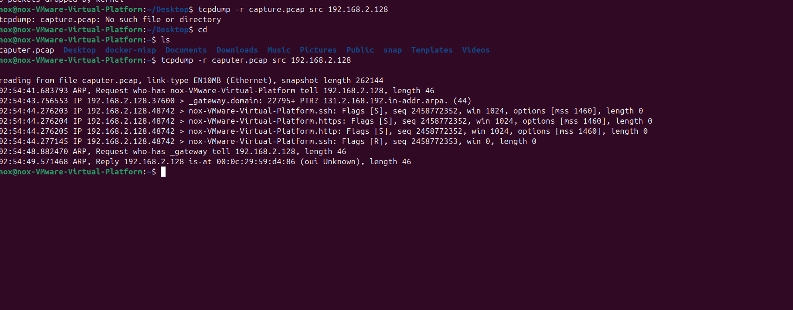

# Q7 — Network Analysis: tcpdump

**Goal:** capture and analyze raw network traffic from the command line and identify indicators of reconnaissance activity.

**ATT&CK mapping:** T1046 – Network Service Discovery

## Capture & analysis command

```bash
tcpdump -r capture.pcap src 192.168.2.128
```

- Source: `192.168.2.128` (Kali attacker host)
- Destination: Ubuntu target server



## Findings

- **`Flags [S]`** — three rapid inbound SYN packets confirming synchronization probes against multiple ports.
- **Simultaneous multi-service targeting** — the same source port (48742) hit SSH, HTTP, and HTTPS endpoints within microseconds of each other.
- **`Flags [R]`** — a reset immediately following the probes, confirming the half-open connections were force-closed rather than completed.

## Why this is flagged as an active scan

- **Microsecond traversal rate** — three distinct protocol probes within a two-millionths-of-a-second window is a definitive signature of automated scripting (e.g. `nmap`), not manual interaction.
- **Cross-protocol targeting** — normal traffic aims at one expected service; hitting SSH and web ports simultaneously from the same source port indicates active attack-surface mapping.

## Conclusion & recommendation

`tcpdump` is useful for quick command-line verification and scripting (e.g., feeding captures into automated pipelines), while Wireshark (Q6) is better for interactive, visual triage. In practice I'd use `tcpdump` for the initial capture on the target host and Wireshark for the deeper packet-level review — and feed both into a scan-detection rule on the perimeter so this kind of activity doesn't rely on someone manually running these tools after the fact.
