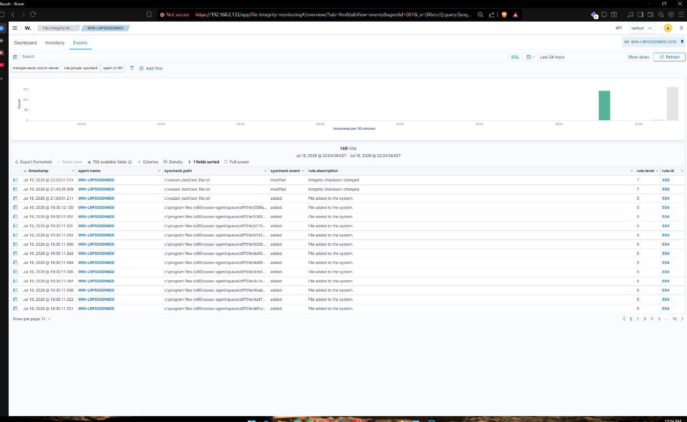
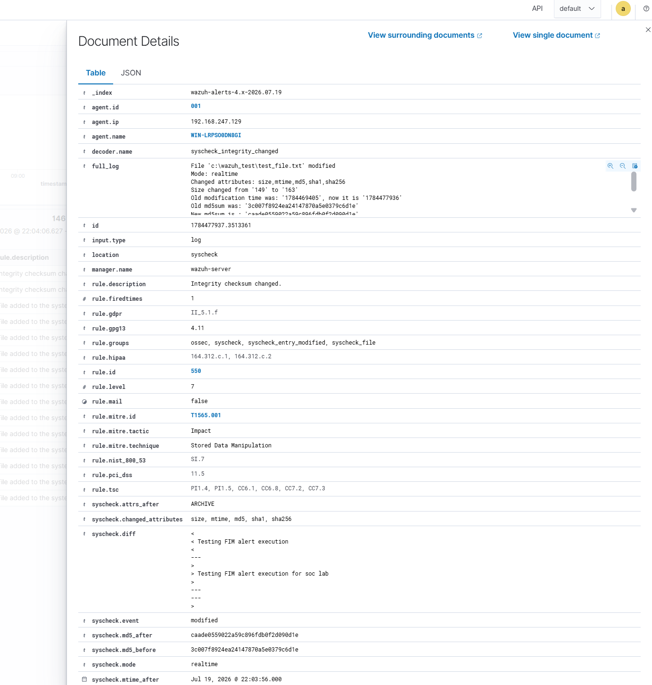

# Q8 — Wazuh: File Integrity Monitoring (FIM)

**Goal:** configure real-time File Integrity Monitoring on a Windows endpoint and confirm Wazuh detects and alerts on an unauthorized modification.

**ATT&CK mapping:** T1565.001 – Stored Data Manipulation

## Setup

- SIEM: Wazuh Manager (Linux)
- Monitored endpoint: Windows Server, agent ID 001
- Monitored path: `C:\wazuh_test\test_file.txt`

## Configuration

1. Enabled `<jsonout_output>` and `<alerts_log>` in the manager's global configuration.
2. Added a real-time FIM rule to the Windows agent's `ossec.conf`:

   ```xml
   <directories check_all="yes" report_changes="yes" realtime="yes">C:\wazuh_test</directories>
   ```

3. Restarted the Wazuh agent service and synchronized the endpoint clock with the manager.
4. Appended a test string to the monitored file to simulate an unauthorized change.

## Detection result

The modification generated an immediate **Severity Level 7** alert:

| Field | Value |
|---|---|
| Rule triggered | ID 550 — Integrity checksum changed |
| ATT&CK mapping | T1565.001 |
| File size | 149 → 163 bytes |
| MD5 before | `3c007f8924ea24147870a5e0379c6d1e` |
| MD5 after | `caade0559022a59c896fdb0f2d090d1e` |





## Conclusion & recommendation

FIM caught the change in real time and captured the full before/after diff, not just "a file changed" — that diff is what makes the alert actionable instead of just noisy. This kind of monitoring matters most on files that shouldn't change outside a controlled process: config files, scheduled task definitions, startup scripts, and — as demonstrated here — anything in a directory an attacker might use to stage a persistence mechanism. I'd tune the noise down in production by scoping FIM to genuinely sensitive paths rather than watching broad directories, since overly broad FIM rules quickly get ignored due to alert fatigue.
