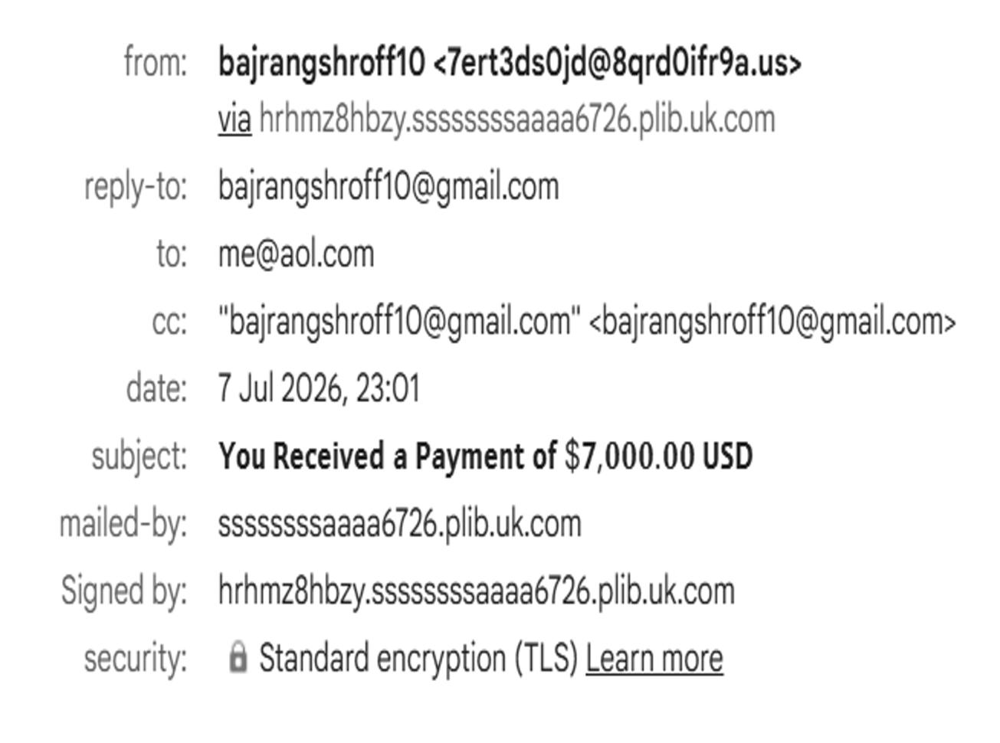
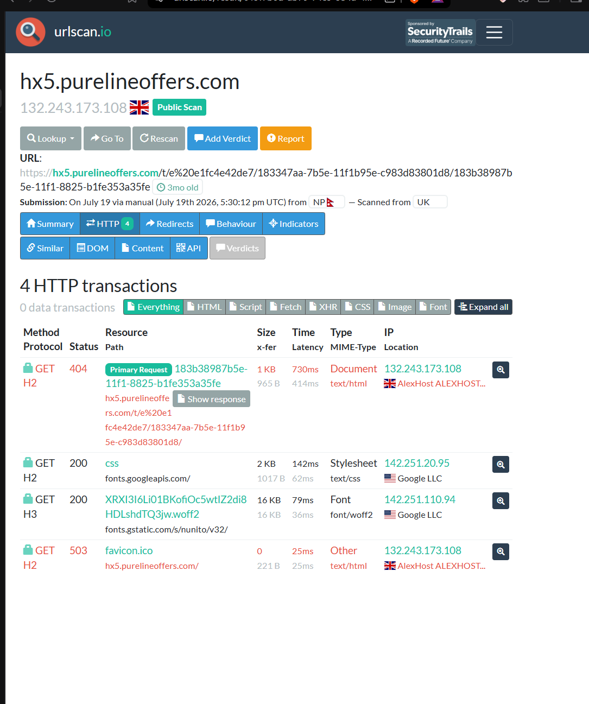

# Q9 — Incident Response: Email Compromise (Phishing Triage)

**Goal:** analyze a reported suspicious email for header forgery and malicious infrastructure, and reach a verdict.

**Category:** Phishing triage

> **Note:** IOCs below (domains, URLs) are shown as plain text, not clickable links, since they point to live/parked infrastructure.

## Analysis process

1. Extracted the raw email headers and transmission metadata.
2. Ran a domain authentication audit — SPF, DKIM, and DMARC — against the visible sender identity.
3. Investigated the embedded call-to-action link in an isolated sandbox (`urlscan.io`) rather than clicking it directly.

## Header & authentication findings

| Check | Result | Detail |
|---|---|---|
| SPF | **FAIL** | Envelope sender domain has no authorized relationship with the sending server |
| DKIM | **FAIL** | Signing domain is completely unrelated to the visible "from" domain |
| DMARC | **FAIL** | Since SPF and DKIM both fail alignment, DMARC fails by definition |

## Indicators of compromise

- **Display-name spoofing** — a familiar-looking display name paired with a completely unrelated sending domain.
- **Unaligned relay infrastructure** — the signing/relay domain shares no relationship with either the display name or the "from" domain.
- **Tracking link** — the call-to-action resolves through a multi-hop redirect chain (4 HTTP transactions across 3 subdomains, 2 countries) before landing on a generic "Not Found" page, a common technique to evade static URL blocklists while still logging click-throughs.

## Verdict

**Malicious — phishing / infrastructure-tracking node.**

All three authentication layers failing simultaneously, combined with sender/relay misalignment and an evasive redirect chain, is enough on its own to call this malicious without needing to fully unwind the final landing page.

## Conclusion & recommendation

SPF/DKIM/DMARC failure is usually sufficient for a fast triage verdict — you don't need to click through the full redirect chain to make the call. That said, the sandboxed URL trace is still valuable for extracting IOCs (destination IP, hosting provider, ASN) to push to the perimeter firewall/blocklist. I'd recommend: purge the message from the mail gateway, block the identified domains/IPs at the perimeter, and — since SPF/DKIM/DMARC caught this cleanly — audit whether the org's own DMARC policy is set to `reject` rather than `none`/`quarantine`, since a permissive DMARC policy is what let something this obviously spoofed reach an inbox in the first place.
