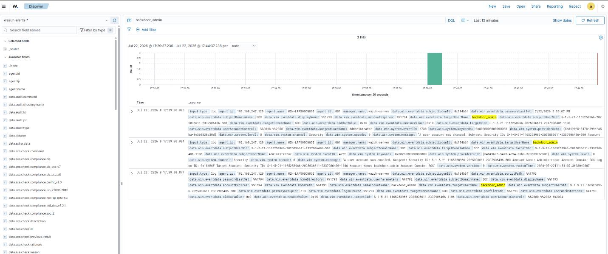
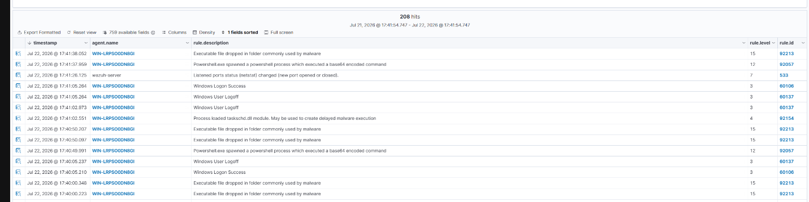

# Q10 — Full Incident Response Scenario

**Goal:** run a complete detection-through-recovery incident response exercise, correlating Wazuh SIEM, Windows Security logs, and network flow logs into a single attack timeline.

**Framework:** NIST SP 800-61 Rev. 2

**ATT&CK mapping:** Persistence, Privilege Escalation, Execution, Defense Evasion, Exfiltration

## Scenario

Multiple correlated alerts fired on host `WIN-LRPS0ODN8GI` (`192.168.247.129`): an unauthorized local admin account was created, base64-encoded PowerShell payloads executed, and abnormal outbound traffic followed.

## Correlated timeline

| Time | Source / Rule | Event | Phase |
|---|---|---|---|
| 17:39:08 | Windows 4720 | User account created (`backdoor_admin`) | Persistence |
| 17:39:08 | Windows 4722 | Account enabled | Persistence |
| 17:39:08 | Windows 4738 | Account modified / added to admin group | Privilege Escalation |
| 17:40:49 | Wazuh 92057 (Lvl 12) | PowerShell spawned with base64 payload | Execution |
| 17:40:50 | Wazuh 92213 (Lvl 15) | Executable dropped in suspicious directory | Defense Evasion |
| 17:41:05 | Windows / Rule 60106 | Interactive logon success | Initial Access |
| 17:41:37 | Wazuh 92057 (Lvl 12) | Secondary base64 PowerShell execution | Execution |
| 17:42:10 | Firewall / NetFlow | Egress anomaly — 1.8 GB outbound on port 443 | Exfiltration |

## Phase-by-phase response

**1. Detection & Analysis**
Correlated Windows Event IDs 4720/4722/4738 confirming unauthorized account creation, and Wazuh Rule 92057 flagging encoded PowerShell (a common defense-evasion pattern used to slip past naive command-line signatures). Confirmed the incident was contained to a single host.

**2. Containment**
Issued host isolation via Wazuh Active Response, blocked the egress destination IP at the perimeter firewall, and immediately disabled the rogue account and any compromised admin credentials.

**3. Eradication**
Removed the `backdoor_admin` account (`net user backdoor_admin /delete`), killed the malicious PowerShell processes, deleted the dropped executable, rotated all administrative/service credentials on the host, and tightened RDP/interactive session policy with MFA enforcement.

**4. Recovery**
Ran Wazuh FIM/Rootcheck scans to confirm a clean state, lifted network isolation, and applied an elevated logging profile for 72 hours post-recovery to catch any signs of reinfection.

## Indicators of compromise

- Host: `WIN-LRPS0ODN8GI` (192.168.247.129)
- Unauthorized account: `backdoor_admin`
- Event IDs: 4720, 4722, 4738
- Wazuh rules: 92057 (base64 PowerShell execution), 92213 (executable drop)

## Lessons learned & recommendations

- **Automate the obvious response** — accounts created outside a defined maintenance window should be auto-disabled by Active Response rather than waiting on manual triage.
- **Restrict encoded PowerShell** — enforce AppLocker/SRP or PowerShell Constrained Language Mode to block `-EncodedCommand` execution from non-system contexts.
- **Enforce least privilege / JIT access** — standing local admin rights make step 1 of this whole chain (account creation → privilege escalation) trivial; Just-In-Time elevation would have forced the attacker through an additional, more visible step.
