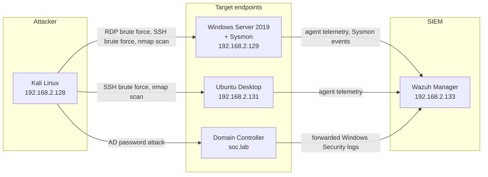

# SOC Analyst Lab: Centralized Logging & Security Monitoring

Hands-on blue-team lab work covering SIEM detection engineering, endpoint telemetry analysis, Active Directory hardening, Linux authentication monitoring, network forensics, file integrity monitoring, phishing triage, and a full incident-response walkthrough.

Everything here was built and tested in a self-hosted virtual lab (Kali Linux, Windows Server 2019 + AD, Ubuntu, and a Wazuh SIEM manager) rather than a hosted training platform, so every alert, log line, and screenshot in this repo was generated by an attack I actually ran against my own environment.

## Why this repo exists

I wanted to go past reading about detections and actually build the pipeline: generate real attacker behavior, watch it land in raw logs, and then confirm the SIEM correctly correlates and escalates it. Each scenario below maps to a MITRE ATT&CK technique and closes with a defensive recommendation, the way a Tier 1/2 SOC analyst would document a real finding.

## Lab architecture

| Role | Host | IP / Identifier |
|---|---|---|
| Attacker machine | Kali Linux | 192.168.2.128 |
| Target Windows endpoint | Windows Server 2019 (`WIN-LRPS0ODN8GI`) | 192.168.2.129 |
| SIEM / centralized logging | Wazuh Manager | 192.168.2.133 |
| Target Linux endpoint | Ubuntu Desktop | 192.168.2.131 |
| Domain controller | Active Directory (`soc.lab`) | internal |

Tools used: **Wazuh** (SIEM/XDR + FIM), **Sysmon**, **THC-Hydra**, **Wireshark**, **tcpdump**, **Active Directory / GPMC**, **urlscan.io**, Windows Event Viewer.

## Scenarios

| # | Scenario | Focus | ATT&CK mapping |
|---|---|---|---|
| 01 | [Wazuh – brute force detection](01-wazuh-brute-force-detection/) | RDP dictionary attack, log correlation, alert escalation | T1110 (Brute Force) |
| 02 | [Sysmon process analysis](02-sysmon-process-analysis/) | Process lineage, command-line visibility, LOLBins | T1087.001 (Account Discovery) |
| 03 | [Active Directory – GPO deployment](03-ad-gpo-deployment/) | Group Policy hardening, OU scoping, client verification | Defensive control |
| 04 | [Active Directory – attack detection](04-ad-attack-detection/) | Account lockout forensics, source attribution | T1110 (Brute Force) |
| 05 | [Linux authentication monitoring](05-linux-auth-monitoring/) | SSH auth log analysis, normal vs. suspicious baselining | T1110 (Brute Force) |
| 06 | [Network traffic analysis – Wireshark](06-wireshark-traffic-analysis/) | Live capture, SYN scan identification | T1046 (Network Service Discovery) |
| 07 | [Network analysis – tcpdump](07-tcpdump-analysis/) | CLI packet capture and filtering | T1046 (Network Service Discovery) |
| 08 | [Wazuh – file integrity monitoring](08-wazuh-file-integrity-monitoring/) | Real-time FIM, checksum deltas | T1565.001 (Stored Data Manipulation) |
| 09 | [Incident response – email compromise](09-incident-response-email-compromise/) | SPF/DKIM/DMARC analysis, IOC extraction | Phishing triage |
| 10 | [Full incident response scenario](10-full-incident-response-scenario/) | End-to-end IR using NIST SP 800-61 | Persistence, privilege escalation, exfiltration |

## Key takeaways

- Correlation rules matter more than single-event alerts: Wazuh only escalates a brute-force attempt to a high-severity incident once it clusters repeated `4625`/logon-failure events within a time window (see [scenario 01](01-wazuh-brute-force-detection/) and [04](04-ad-attack-detection/)).
- Command-line visibility (Sysmon Event ID 1) is what turns a "PowerShell spawned cmd.exe" observation into an actionable finding — the parent-child relationship and arguments are what let you map it to a specific ATT&CK technique instead of just flagging "PowerShell ran."
- Email authentication headers (SPF/DKIM/DMARC) are usually enough on their own to triage a phishing report before you ever touch the embedded link.
- A believable IR writeup needs a timeline that correlates multiple log sources (SIEM + Windows Security log + NetFlow) — single-source alerts tell you *that* something happened, correlated timelines tell you the *story*.

## Notes on this repo

- All IPs are private lab addresses (RFC 1918); no real infrastructure is referenced.
- The phishing sample IOCs are shown as plain text/code blocks rather than clickable links.
- This lab environment was built for a defensive-security course; the writeups here are my own analysis and documentation of a self-run lab, not a course's proprietary answer key.
